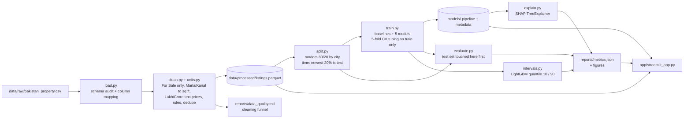

# Pakistan House Price Predictor

Estimate the **asking price** of a property in Pakistan from its size, location, type, bedrooms and bathrooms, with an
80% price range, an explanation of what drove the estimate, and five comparable listings, in a local Streamlit app.

The project is about doing the data science carefully: documented cleaning rules with a funnel table, leakage-safe
features, two evaluation setups (random and time-based), baselines every model must beat, error analysis, prediction
intervals with measured coverage, and SHAP explanations.

> **About the numbers.** The tables below were generated by running this pipeline on the real Kaggle file
> (`data/raw/pakistan_property.csv`, not committed). Every table is filled from `reports/metrics.json` and
> `reports/data_quality.md` by code (`python -m scripts.update_readme`); nothing is typed in by hand. Runs on the
> synthetic sample (used only for tests and CI) are labelled as synthetic and must never be reported.

## Table of contents

- [Data](#data)
- [Pipeline](#pipeline)
- [Setup](#setup)
- [How to run](#how-to-run)
- [Results](#results)
- [Cleaning funnel](#cleaning-funnel)
- [Key figures](#key-figures)
- [Random split vs time split](#random-split-vs-time-split)
- [Design decisions](#design-decisions)
- [The app](#the-app)
- [Tests and CI](#tests-and-ci)
- [Project structure](#project-structure)
- [Limitations](#limitations)
- [Future work](#future-work)
- [Screenshots](#screenshots)

## Data

- **Source:** a public Kaggle dataset of Pakistani property listings scraped from Zameen.com, for example
  "Pakistan House Price Dataset" (roughly 150k+ rows with columns such as `property_type`, `price`, `location`,
  `city`, `province_name`, `latitude`, `longitude`, `baths`, `bedrooms`, `area`, `Area Type`, `Area Size`, `purpose`,
  `date_added`).
- **Licence:** this repository does not redistribute the data. The licence is stated on the Kaggle dataset page you
  download from (I could not verify it offline, so check it there), and the listing content originates from Zameen.com,
  whose terms of use apply to the underlying material. The code in this repository is MIT licensed (see `LICENSE`).
- **No scraper.** The project never scrapes anything. `data/raw`, `data/interim` and `data/processed` are git-ignored.

### Download steps

1. Sign in to Kaggle (free) and download the CSV of the dataset above.
2. Save it as `data/raw/pakistan_property.csv`.
3. If a step is run without the file, it stops with a message saying where to put it.

Some versions of the dataset (for example `Zameen Property Data.csv` from "zameencom-property-data-pakistan") have no `Area Size` / `Area Type` columns, only an `area` text column such as `5.6 Marla` or `2 Kanal`, and dates like `07-17-2019` (month first); both layouts are handled. Column names are not assumed. `python -m house_prices.load` prints the file's real schema, row count and a sample, and
the mapping from your file's columns to the project's canonical names. If a column is not found, edit
`COLUMN_ALIASES` in `src/house_prices/config.py`; lookups ignore case, spaces and underscores.

### Synthetic sample (tests and CI only)

`python -m scripts.make_sample_data` writes `data/sample/synthetic_pakistan_property.csv`: fake listings with the
same schema and deliberately messy rows. Every row has `agency = "SYNTHETIC DATA"`, which the pipeline detects, and
any report, model metadata or app page built from it says so.

## Pipeline



## Setup

Python 3.11 is the target (the pins in `requirements.txt` support 3.11 and later). In PowerShell, from the project folder:

```powershell
py -3.11 -m venv .venv
.\.venv\Scripts\Activate.ps1
python -m pip install --upgrade pip
python -m pip install -r requirements.txt
python -m pip install -e .
```

If PowerShell blocks the activation script, run `Set-ExecutionPolicy -Scope Process -ExecutionPolicy Bypass` once in that
window and activate again. In VS Code, pick `.venv` as the interpreter (Ctrl+Shift+P, "Python: Select Interpreter").
Everything runs locally with free tools; there are no API keys.

## How to run

Every step is a `python -m` command and each one checks that its inputs exist.

```powershell
python -m house_prices.load          # print the real schema, row count, sample and column mapping
python -m house_prices.clean         # rules, funnel, data/processed/listings.parquet, reports/data_quality.md
python -m house_prices.split         # random and time splits (ids only, data untouched)
python -m house_prices.train         # baselines, five tuned models, model files and metadata
python -m house_prices.evaluate      # first use of the test set: metrics, error analysis, figures
python -m house_prices.intervals     # 80% prediction intervals and their coverage
python -m house_prices.explain       # SHAP figures and summary
python -m scripts.update_readme      # fill the tables in this README and the model card from metrics.json
python -m streamlit run app/streamlit_app.py
```

Or run everything in order (add `--notebooks` to build and execute the four notebooks in place):

```powershell
python -m scripts.run_all
python -m scripts.run_all --notebooks
```

Notebooks are generated by `python -m scripts.build_notebooks` and must be executed after the pipeline so their saved
outputs come from the real data:

```powershell
python -m jupyter nbconvert --to notebook --execute --inplace notebooks/01_data_audit.ipynb notebooks/02_eda.ipynb notebooks/03_modelling.ipynb notebooks/04_error_analysis.ipynb
```

Tuning is sized to be laptop-friendly: each search runs on up to 40,000 training rows (`SEARCH_MAX_ROWS` in `train.py`, or `--search-rows N`, `0` for all rows), then the winner is refit on the full training set. Training both splits on 88,000 synthetic training rows took about eight minutes on the development machine. Use `python -m house_prices.train --setup random --models lightgbm` to train a single model.

## Results

Generated from `reports/metrics.json`. Errors are in rupees on the held-out test set; R² is on log price. The
cross-validation column is the mean ± standard deviation of the fold RMSE on log price (lower is better).

<!-- BEGIN:RESULTS -->

**Random split**: train 53,658 listings (2018-08-05 to 2019-08-06), test 13,415 (2018-08-05 to 2019-08-06).

| Model | MAE | RMSE | Median % error | Mean % error | R² (log price) | CV RMSE (log), mean ± std |
|---|---|---|---|---|---|---|
| Baseline: overall median price | PKR 1.76 Crore | PKR 3.96 Crore | 61.4% | 96.8% | -0.006 | 0.996 ± 0.008 |
| Baseline: location median price/sq ft x size | PKR 75.9 Lakh | PKR 3.03 Crore | 21.8% | 35.2% | 0.820 | 0.423 ± 0.005 |
| Linear Regression | PKR 68.16 Lakh | PKR 1.85 Crore | 21.1% | 30.4% | 0.857 | 0.380 ± 0.005 |
| Ridge | PKR 68.44 Lakh | PKR 1.86 Crore | 21.1% | 30.4% | 0.857 | 0.379 ± 0.004 |
| Random Forest | PKR 49.75 Lakh | PKR 1.56 Crore | 14.5% | 21.5% | 0.915 | 0.301 ± 0.004 |
| **XGBoost** | PKR 47.31 Lakh | PKR 1.45 Crore | 13.6% | 19.7% | 0.929 | 0.276 ± 0.004 |
| LightGBM | PKR 47.02 Lakh | PKR 1.51 Crore | 13.7% | 19.8% | 0.928 | 0.277 ± 0.003 |

**Time split**: train 53,524 listings (2018-08-05 to 2019-07-03), test 13,549 (2019-07-04 to 2019-08-06).

| Model | MAE | RMSE | Median % error | Mean % error | R² (log price) | CV RMSE (log), mean ± std |
|---|---|---|---|---|---|---|
| Baseline: overall median price | PKR 1.63 Crore | PKR 3.55 Crore | 62.7% | 118.1% | -0.002 | 0.989 ± 0.004 |
| Baseline: location median price/sq ft x size | PKR 73.47 Lakh | PKR 2.45 Crore | 22.8% | 44.2% | 0.772 | 0.405 ± 0.003 |
| Linear Regression | PKR 64.92 Lakh | PKR 1.57 Crore | 22.0% | 37.5% | 0.821 | 0.367 ± 0.002 |
| Ridge | PKR 64.94 Lakh | PKR 1.57 Crore | 22.0% | 37.5% | 0.821 | 0.367 ± 0.002 |
| Random Forest | PKR 49.1 Lakh | PKR 1.31 Crore | 15.4% | 26.6% | 0.888 | 0.295 ± 0.003 |
| XGBoost | PKR 47.92 Lakh | PKR 1.39 Crore | 14.5% | 23.1% | 0.910 | 0.267 ± 0.004 |
| **LightGBM** | PKR 46.89 Lakh | PKR 1.28 Crore | 14.6% | 23.2% | 0.910 | 0.266 ± 0.004 |

Bold rows are the best tree model by cross-validation, chosen without looking at the test set. Cross-validation used up to 40000 training rows for the tuning search.
<!-- END:RESULTS -->

### Reading the results

- Both tree ensembles and the boosted models beat the two baselines and the linear models by a wide margin on both splits;
  the location price-per-sq-ft baseline is a strong reference, and the gap to it is the value the model adds.
- The time split scores below the random split for the same models, which is the expected optimism of a shuffled test set.
  Cross-validation on the training set is more optimistic still, because it shuffles too.
- The 80% intervals cover noticeably less than 80% of test prices, and less on the time split than on the random split.
  The ranges are too narrow, so treat them as "typical range" rather than a guarantee (see Future work).

### Prediction interval coverage

An 80% interval should contain the true asking price about 80% of the time. Coverage is measured on the test set, overall
and per city, along with how wide the ranges are.

<!-- BEGIN:INTERVALS -->

Nominal coverage is 80%.

| Split | Empirical coverage | Mean width | Median width | Mean width / estimate |
|---|---|---|---|---|
| random | 73.8% | PKR 1.29 Crore | PKR 64.59 Lakh | 54% |
| time | 67.8% | PKR 1.12 Crore | PKR 58.71 Lakh | 53% |

Per city, random split:

| City | Test listings | Coverage | Mean width |
|---|---|---|---|
| Faisalabad | 374 | 70.1% | PKR 82.05 Lakh |
| Islamabad | 2,069 | 71.8% | PKR 1.55 Crore |
| Karachi | 5,008 | 75.3% | PKR 1.37 Crore |
| Lahore | 4,624 | 73.2% | PKR 1.27 Crore |
| Rawalpindi | 1,340 | 74.5% | PKR 80.22 Lakh |

Per city, time split:

| City | Test listings | Coverage | Mean width |
|---|---|---|---|
| Faisalabad | 538 | 65.8% | PKR 67.39 Lakh |
| Islamabad | 2,391 | 67.2% | PKR 1.28 Crore |
| Karachi | 5,188 | 67.0% | PKR 1.18 Crore |
| Lahore | 3,741 | 69.0% | PKR 1.21 Crore |
| Rawalpindi | 1,691 | 69.3% | PKR 67.98 Lakh |
<!-- END:INTERVALS -->

### Where the model is weakest

<!-- BEGIN:ERRORS -->

**Random split**

- By city, the weakest group is 'Faisalabad' with a median error of 16.8% (n=374) against 13.6% overall; the strongest is 'Islamabad' at 12.5%.
- By property type, the weakest group is 'Penthouse' with a median error of 20.7% (n=51) against 13.6% overall; the strongest is 'Lower Portion' at 10.3%.
- By price decile, the weakest group is '1' with a median error of 18.3% (n=1384) against 13.6% overall; the strongest is '7' at 10.4%.
- By location coverage, the weakest group is 'not in training data' with a median error of 21.4% (n=63) against 13.6% overall; the strongest is '200+ listings' at 13.1%.

**Time split**

- By city, the weakest group is 'Karachi' with a median error of 16.8% (n=5188) against 14.6% overall; the strongest is 'Lahore' at 13.0%.
- By property type, the weakest group is 'Penthouse' with a median error of 26.9% (n=45) against 14.6% overall; the strongest is 'House' at 13.9%.
- By price decile, the weakest group is '1' with a median error of 24.8% (n=1357) against 14.6% overall; the strongest is '7' at 12.0%.
- By location coverage, the weakest group is 'not in training data' with a median error of 25.8% (n=76) against 14.6% overall; the strongest is '50-199 listings' at 13.8%.

<!-- END:ERRORS -->

The full breakdown (city, property type, price decile, listings per location), the ten worst predictions with a guessed
reason for each, and the plots are in `notebooks/04_error_analysis.ipynb` and the app's Model performance page.

### Location encoding

<!-- BEGIN:ABLATION -->
| Location encoding | CV RMSE (log) | CV R² (log) | CV median % error |
|---|---|---|---|
| Target encoding (smoothed, cross-fitted) | 0.2767 ± 0.0032 | 0.9225 | 14.2% |
| One-hot | 0.2762 ± 0.0028 | 0.9228 | 14.1% |
<!-- END:ABLATION -->

### What drives the estimate

<!-- BEGIN:SHAP -->
Mean |SHAP| by input group for XGBRegressor on 2,000 test listings (log-price units).

| Input group | Mean |SHAP| |
|---|---|
| Size | 0.5392 |
| Location | 0.2291 |
| Property type | 0.1241 |
| Bedrooms | 0.0850 |
| Bathrooms | 0.0613 |
| Distance to city centre | 0.0590 |
| City | 0.0219 |
<!-- END:SHAP -->

## Cleaning funnel

Copied from `reports/data_quality.md`, which `python -m house_prices.clean` writes. Each rule is a small function with its
own unit tests.

<!-- BEGIN:FUNNEL -->
| Step | Rule | Rows removed | Rows modified | Rows remaining |
|---|---|---:|---:|---:|
| raw | Rows in the raw file | 0 | 0 | 191,393 |
| for_sale | Purpose is not 'For Sale' (rentals are a different problem) | 64,375 | 0 | 127,018 |
| price_present | Price missing, unparseable, zero or negative | 2 | 0 | 127,016 |
| price_floor | Price below the minimum plausible sale price (likely a rent, deposit or typo) | 76 | 0 | 126,940 |
| area_present | Area missing, unparseable, zero or negative | 11 | 0 | 126,929 |
| area_bounds | Area outside the plausible range in sq ft | 11 | 0 | 126,918 |
| categories_present | City, location or property type missing | 0 | 0 | 126,918 |
| date_present | date_added missing or unparseable | 0 | 0 | 126,918 |
| rooms_present | Bedrooms or baths missing | 0 | 0 | 126,918 |
| zero_bedrooms | Zero bedrooms on a house, flat or portion | 14,232 | 0 | 112,686 |
| absurd_rooms | Bedroom or bath count above the cap or negative | 10 | 0 | 112,676 |
| rare_city | City with too few listings to model or evaluate | 0 | 0 | 112,676 |
| rare_type | Property type with too few listings | 23 | 0 | 112,653 |
| coordinates | Coordinates outside Pakistan or too far from the listing's city centre set to missing (rows kept) | 0 | 16 | 112,653 |
| exact_duplicates | Exact duplicate listings (every cleaned column identical) | 12,948 | 0 | 99,705 |
| near_duplicates | Near duplicates: same city, location, size, price, bedrooms, type and coordinates (to about 11 m) | 32,230 | 0 | 67,475 |
| ppsf_outliers | Price per sq ft outside the per-city IQR fence on log price per sq ft | 402 | 0 | 67,073 |
<!-- END:FUNNEL -->

## Key figures

Written to `reports/figures/` by the notebooks and the pipeline.

| Figure | File |
|---|---|
| Median price per sq ft by location (map) | `reports/figures/price_map.png` and interactive `price_map.html` |
| Model comparison, both splits | `reports/figures/model_comparison.png` |
| Predicted vs actual | `reports/figures/predicted_vs_actual_random.png`, `..._time.png` |
| Error by group | `reports/figures/error_by_group_random.png`, `..._time.png` |
| SHAP mean absolute value | `reports/figures/shap_bar.png` |
| SHAP beeswarm | `reports/figures/shap_beeswarm.png` |
| SHAP waterfall for one listing | `reports/figures/shap_waterfall_example.png` |

Once the pipeline has run on the real data, embed the images you like, for example
``.

## Random split vs time split

Both are reported side by side.

1. **Random split.** Listings are shuffled and 80% train, 20% test, stratified by city, with a fixed `random_state`.
   The test set contains listings from the same weeks, agents and near-duplicate advertisements as the training set, so the
   model is partly being asked to recognise what it has already seen. This tends to give the more flattering score.
2. **Time split.** Listings are ordered by `date_added`; the model trains on the older listings and is tested on the
   newest 20%. This mimics real use, where the model prices listings that appear after it was trained. It usually gives a
   worse, more honest score, especially if the market moved over the period.

The test set is created first and is read for the first time in `evaluate.py`. `train.py` loads training rows only
(`split.load_train`), and a test checks that changing test-row prices does not change a trained model. Cross-validation
inside the training set is random 5-fold in both setups, so for the time split it is more optimistic than the time-split
test; that gap is exactly what is being shown.

## Design decisions

- **Only "For Sale" listings.** Rentals are a different problem with different price scales.
- **Areas in sq ft.** Marla, Kanal, sq yd, sq ft and sq m are converted in `units.py`. A Marla has no single official
  size, so the factor is a config value (`MARLA_SQFT_SETTING`). The default `"auto"` tries to infer it from the data
  (locations that list both Marla and sq ft/sq yd areas) and accepts it only inside 200-300 sq ft; otherwise it falls back to
  272.25 sq ft. Kanal is 20 Marla. The factor used, and where it came from, is written to `reports/data_quality.md` and
  `models/model_metadata.json`, and the app uses the same factor. If the raw file only uses Marla and Kanal (no other unit to
  compare against), the fallback applies, and changing the setting rescales all sizes consistently.
- **Prices.** Text prices such as "1.5 Crore" or "85 Lakh" are converted to rupees (`units.parse_price`); the count is in the report.
- **Robust outlier rules.** Price per sq ft is checked against a per-city IQR fence on log price per sq ft, not a global
  cutoff. Because that fence uses price, it is computed on the whole cleaned file before splitting: the evaluation describes
  plausible listings, not every raw record.
- **Duplicates.** The scrape contains the same advertisement re-listed on many dates. Exact duplicates are dropped, and
  near duplicates are listings with the same city, location, size, price, bedrooms, type and coordinates (to about 11 m).
  The coordinates matter: without them, distinct houses that share a round price and a Marla size (very common in large
  societies) were removed as well, and far fewer listings survived. `near_dup_coordinate_decimals=None` restores the
  coordinate-free rule.
- **Target is log(price).** Predictions are converted back to rupees for reporting.
- **No target leakage.** Price per sq ft and anything price-derived is never a feature. `FeatureBuilder` reads only the eight
  input columns, and tests fail if a feature is derived from the target.
- **Location handling.** Locations with fewer than `MIN_LOCATION_COUNT` training listings become "Other (city)"; the
  rest are target-encoded with smoothing and 5-fold cross-fitting, inside the scikit-learn `Pipeline`, so the encoder is refit
  on each training fold only. A one-hot alternative is compared in the results.
- **Deployed model.** The best tree model (Random Forest, XGBoost or LightGBM) by cross-validated log RMSE, trained on the
  random-split training set so the reported test scores describe exactly the deployed model. Linear models are benchmarks;
  the app's SHAP explanations need a tree model.
- **Intervals.** Two LightGBM quantile models (10th and 90th percentiles) use the tuned LightGBM parameters. The range is
  clipped so that it always contains the point estimate. Coverage is reported honestly, whether or not it reaches 80%.
- **Explanations.** SHAP `TreeExplainer`, with one-hot and encoded columns mapped to readable names and grouped into
  Location (encoded location and coordinates), Size, City, Property type, Bedrooms, Bathrooms and Distance to centre for the plain-English sentence.

## The app

```powershell
python -m streamlit run app/streamlit_app.py
```

- **Predict:** city, searchable location list filtered to the city, property type, size with Marla / Kanal / sq ft,
  bedrooms and bathrooms, three example presets. Shows the estimate and 80% range in Lakh/Crore with exact rupees beneath,
  price per sq ft, a SHAP waterfall with a plain-English sentence, five comparable listings, and a warning for rare locations.
- **Market explorer:** price map and price-per-sq-ft charts with a city filter.
- **Model performance:** tables and charts read from `reports/metrics.json`.
- **About & limitations.**

The model is loaded once with `st.cache_resource`. If the model files are missing, the page shows which commands to run.
Every page carries the disclaimer that estimates are based on historical asking prices, are for learning, and are not
financial or property advice.

## Tests and CI

```powershell
python -m pytest
python -m ruff check .
```

The suite runs on synthetic data only: unit conversion (including a configurable Marla factor), Lakh/Crore parsing and
formatting, each cleaning rule on small handmade frames, leakage checks (target encoding inside the pipeline, test set
untouched, no price-derived feature), the time split, prediction ordering (`lower <= estimate <= upper`), and Streamlit
`AppTest` smoke tests for every page. `.github/workflows/ci.yml` runs ruff and pytest on Python 3.11.

## Project structure

```text
pakistan-house-prices/
  data/raw, data/interim, data/processed   (git-ignored; raw file goes in data/raw)
  notebooks/     01_data_audit, 02_eda, 03_modelling, 04_error_analysis
  src/house_prices/
    config.py    paths, column aliases, thresholds, Marla setting, city centres
    load.py      read the CSV, print the schema, map columns
    units.py     Marla/Kanal/sq yd conversion, Lakh/Crore price parsing, haversine
    clean.py     cleaning rules, funnel, data_quality.md
    features.py  feature builder, location grouping, preprocessing pipeline
    split.py     random and time splits
    train.py     baselines, tuning, model files, metadata
    evaluate.py  metrics, error analysis, figures, metrics.json
    intervals.py 80% prediction intervals and coverage
    explain.py   SHAP global and local explanations
    predict.py   load the model, validate inputs, predict, comparables
    formatting.py PKR, Lakh and Crore formatting
  app/           streamlit_app.py and pages/
  models/        house_price_model.joblib, interval models, model_metadata.json, location_index.csv
  reports/       figures/, metrics.json, data_quality.md, model_card.md
  scripts/       make_sample_data, build_notebooks, run_all, update_readme
  tests/
```

## Limitations

- **Asking prices, not sale prices.** Listings usually ask for more than the final deal, by an amount that varies.
- **A limited time period.** The data covers a short window of listings. Prices have since moved with inflation, so today's
  market can sit well above anything the model has seen; the time split shows how much performance degrades even within the window.
- **Uneven coverage across cities.** Large cities and popular locations have many listings, while small cities and rare
  locations have few. Errors are larger there, and the app warns when a location is rare.
- **Marla ambiguity.** Local Marla sizes differ (225 and 272.25 sq ft are both used), so every Marla-denominated size, and
  therefore price per sq ft, is only as accurate as the factor chosen.
- **Missing determinants of price.** Age, condition, floor, furnishing, corner plots and road width are not in the data.
- **Asking-price typos remain.** The worst predictions are mostly listings whose asking price is far below anything plausible
  for the location (a missing digit). The per-city price-per-sq-ft fence is deliberately wide and does not catch them all, so
  mean error is inflated by them; the median error is the more representative number.
- **Cleaning shapes the population.** Outlier and duplicate rules use price and are applied before splitting. Near-duplicate
  removal can also remove genuinely distinct units.
- **Duplicated listings across splits.** Reposted advertisements that differ slightly can appear on both sides of a random split.
- **Not advice.** The project is for learning.

## Future work

- Evaluate on a later scrape to measure drift directly, and inflation-adjust prices.
- Try conformalised quantile regression to tighten interval coverage in small cities.
- Add listing text features and image-based signals, if a source with permission is available.
- Rolling-origin (expanding window) evaluation instead of a single time split.
- Per-city models or a hierarchical location effect for thin locations.
- Monitoring of input drift in the app.

## Screenshots

Capture these once the model has been trained on the real data (save into `reports/figures/screenshots/`):

1. **Predict** with an example preset selected: estimate, range, waterfall and comparables visible.
2. **Predict** with a rare location selected, showing the reliability warning.
3. **Market explorer** with the map and a city filter applied.
4. **Model performance** showing the random and time split tables.
5. **About & limitations.**

Screenshots: _to be added_.

## Licence

MIT for the code (see `LICENSE`). See [Data](#data) for the dataset.
